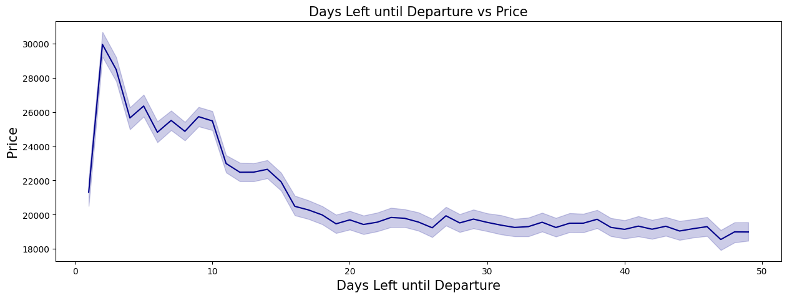

# 758231

# **Air transportation fare prediction**

**Team members:**
- Claudia Compagnone 758231
- Nicolò Rosso 758991
- Giovanni Raimondo Quaratino 759111

## **Introduction:**
The project aims to provide a predictive model for flight ticket prices for a leading Indian travel company. The model uses factors including airline, flight number, source and destination cities, departure and arrival times, ticket class, flight duration, number of stops, and the number of days left until departure to predict prices. The goal is to offer a reliable tool that can assist customers in their decision-making process and help airlines in devising strategic pricing policies.

## **Methods:**

### **Data Preprocessing:**

#### **Programming environment:**
We used Python as programming language and the web-based JupyterLab as IDE. We imported the following libraries: pandas 1.5.2, numpy 1.23.5, matplotlib 3.7.1, seaborn 0.12.2, dython 0.7.3, sklearn 1.2.0, xgboost 1.7.3, shap 0.41.0, bayesian-optimization 1.4.3.

#### **Data Cleaning:**
Once we read the csv file into a pandas DataFrame, we moved to the cleaning phase:
- we checked for duplicate and nan values in the dataset, but there were none.
- outliers, which can often skew the results of a model, were detected and removed using the Interquartile Range (IQR) method. In this method, a data point was considered an outlier if it was below (1st Quartile - 1.5IQR) or above (3rd Quartile + 1.5IQR). We removed a total of 123 outliers (going from 300153 to 300030 observations).
- we transformed the duration variable (originally in hours) into minutes.

#### **Exploratory Data Analysis (EDA):**
During EDA, we sought to visualize and understand the dataset's various features and their interrelationships. 
First of all, we realized a correlation matrix, that was useful in order to decide whether we could drop some variables which were too highly correlated and could raise collinearity-related problem. In our case, we used dyplot's functionalities to visualize correlations between both categorical and numerical variables. More specifically, we made use of dyplot's heatmaps, which are capable of representing correlations in a visually intuitive manner. This allowed us to efficiently analyze the pairwise correlation of multiple features in our dataset at once.

After visualizing the distribution of our variables, we investigated how they relate to price, in particular, we tried to answer the following questions:

**1. How is price affected by the days left until plane departure?**

**2. Is price affected by the source and destination city?**

**3. How does the airfare vary between Economy and Business class?**

**4. Is price affected by departure time and arrival time?**

**5. How does the airfare vary with the number of stops?**

We found that the price of a ticket had substantial correlations with the class of the ticket, the duration of the flight, and the number of stops. Longer flights and higher class types (business, first class) tend to cost more, which explained these correlations.

#### **Feature Selection and Additional Transformations:**
Upon reviewing the correlation matrix, we discovered a perfect positive correlation between the flight variable and airline, which led us to drop the flight variable.

In the data preprocessing stage, we utilized the geocoding service of the geopy library, Nominatim, to extract geographical coordinates (latitude and longitude) for each unique source and destination city. These coordinates were stored in Python dictionaries for efficient retrieval.

Subsequently, we enriched our DataFrame by introducing new columns for the latitude and longitude corresponding to each source and destination city. The geographical coordinates were mapped directly from the respective dictionaries.

We then calculated the haversine distances, using vectorized operations from numpy for computational efficiency, between each source and destination city pair. The haversine formula, which computes great-circle distances between two points on a sphere from their longitudes and latitudes, was particularly suitable in our context for calculating Earth distances between cities.

Lastly, we converted all non-numeric variables in our dataset into categorical types.

These transformations were implemented to aid model comprehension of the features, enabling more precise associations with flight prices, and enhance the effectiveness of subsequent predictive analysis or modeling tasks.

## **Experimental Design:**

#### **Train-Test split:**
The dataset was split into a training set (75%) and a test set (25%). 

#### **Baseline model:**
A **simple Linear Regression model** was used as the **baseline** due to its simplicity and common usage in predictive modeling. However, given the complexity and high-dimensionality of the dataset, more sophisticated machine learning models were employed, including Ridge, Lasso, SVR, Random Forest, and XGBoost.

#### **More flexible models of non-linear relationships between the predictors and the response variable:**
Regularization methods such as Ridge and Lasso Regression were used as they extend simple linear regression by adding a penalty term to the loss function, which helps to control overfitting and improve generalization. 
Then, we tried even to train a Support Vector Regression (SVR) model, but the performance was below the previous models so we rejected it.

#### **Ensemble learning methods:**
We then moved to ensemble learning models, combining decisions from multiple underlying models, and using a voting technique to determine the final prediction. In particular, we built and tuned a Random Forest and an Extreme Gradient Boosting (XGBoost) model. We decided to use these two algorithms because one implements Boosting and one Bagging technique to sample the dataset.
The Random Forest model was selected for its ability to handle a large number of features and its robustness to outliers and non-linear data.
The XGBoost model was particularly highlighted due to its effectiveness in handling both sparse and dense datasets. 

To understand the contribution of each feature to the predictions, we performed feature importance analysis using SHAP (SHapley Additive exPlanations). This approach offers a unified measure of feature importance that allocates each feature an importance value for a particular prediction.
Through Shap, we found that 'class', 'duration', and 'number of stops' were the most influential predictors of flight prices. This aligns with our initial findings during the Exploratory Data Analysis phase, confirming that these factors significantly impact the price of a flight ticket.

This model was further refined by tuning its hyperparameters using Bayesian Optimization. Bayesian Optimization is a sequential design strategy for global optimization of black-box functions that works by constructing a posterior distribution of functions to find the maximum of these functions efficiently.

#### **Evaluation metrics**
We chose to evaluate our models with three different metrics:
- **RMSE**: it is the square root of mean squared error (squared distance between actual and predicted values). The output value you get is in the same unit as the required output variable which makes interpretation of loss easier. **Important** the prices in our dataset are given in rupees (1 INR == 0.012 USD), the Indian currency, this is why the RMSE is so high.
- **MAPE**: the Mean Absolute Percentage Error is a measure of accuracy. It is the mean of all absolute percentage
errors between the predicted and actual values. As a rule of thumb, a good result for MAPE is < 20%.
- **R2**: it is a measure of goodness of fit (how well data are approximated by predictions). It measures the proportion of variance in the dependent variable that can be predicted from the independent variables, providing a clear and interpretable measure of the models' performance.

Below you can see a flowchart summarizing the steps we followed.

## **Results:**
We have chosen to utilize the XGBoost model with DMatrices for our final model due to its superior fit to our data, as evidenced by the residual plot. 

In addition to providing a good fit to our data, XGBoost has also proven to be computationally less expensive than other models we considered, such as the Random Forest model.

Although the Random Forest model also yielded good results, its computational expense was a significant drawback, especially when dealing with larger datasets. On the other hand, XGBoost was not only able to handle our dataset efficiently, but it also provided a better fit, making it our model of choice for this task.

## **Conclusions:**
The XGBoost model, with its high R2 score, provides a robust tool for predicting flight prices. This can offer valuable insights to customers and airlines, aiding in informed decision-making and strategic pricing. It's important to note, however, that while the model performs well on the given dataset, real-world conditions may introduce additional variables such as fuel prices and economic conditions. Future work could focus on incorporating these variables and expanding the dataset to improve the model's predictive accuracy and generalizability.
